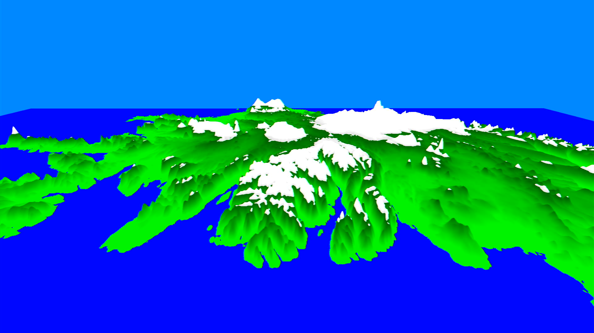

# gx2-heightmap
A GX2 heightmap renderer for the Wii U written in exactly 100 lines of C++ (`stb_image` and shaders don't count :p).  
Ignore the bad performance, this is terribly optimized. Also ignore the code style, this has been cramped into 100 lines.

The heightmap has been rendered with [heightmapper](https://tangrams.github.io/heightmapper/).

Requires `ppc-glm` for building.  

## Note about shaders
The bundled shader in `data` has been assembled using [latte-assembler](https://github.com/decaf-emu/decaf-emu) with the following command:  
```
latte-assembler assemble --vsh=shader.vsh --psh=shader.psh data/shader.gsh
```
